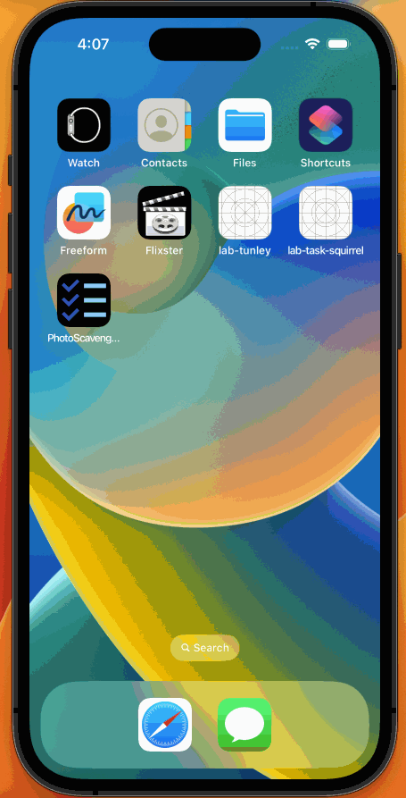

# Project 4 - *Photo Scavanger Hunt*

Submitted by: **Nuria Perez Casas**

**Photo Scavanger Hunt** is an app that gives you a series of tasks to do and then it asks you to add a photo to hold you accountable. 

Time spent: **4** hours spent in total

## Required Features

The following **required** functionality is completed:

- [X] App displays list of hard-coded tasks
- [X] When a task is tapped it navigates the user to a task detail view
- [X] When user adds photo to complete the tasks, it marks the task as complete
- [X] When adding photo of task, the location is added
- [X] User returns to home page (list of tasks) and the status of your task is updated to complete
 
The following **optional** features are implemented:

- [ ] User can launch camera to snap a picture    

The following **additional** features are implemented:

- [ ] List anything else that you can get done to improve the app functionality!

## Video Walkthrough

Here's a walkthrough of implemented user stories:

<!-- Replace this with whatever GIF tool you used! -->
GIF created with [LICEcap](https://www.cockos.com/licecap/) for macOS and Windows
<!-- Recommended tools:
[Kap](https://getkap.co/) for macOS
[ScreenToGif](https://www.screentogif.com/) for Windows
[peek](https://github.com/phw/peek) for Linux. -->

## Notes

No challenges were encountered and I was able to build to a device. I wanted to try the UIImagePickerController to allow the user to take a picture but I didn't have time to implement it. 

## License

    Copyright [2023] [Nuria Perez Casas]

    Licensed under the Apache License, Version 2.0 (the "License");
    you may not use this file except in compliance with the License.
    You may obtain a copy of the License at

        http://www.apache.org/licenses/LICENSE-2.0

    Unless required by applicable law or agreed to in writing, software
    distributed under the License is distributed on an "AS IS" BASIS,
    WITHOUT WARRANTIES OR CONDITIONS OF ANY KIND, either express or implied.
    See the License for the specific language governing permissions and
    limitations under the License.
